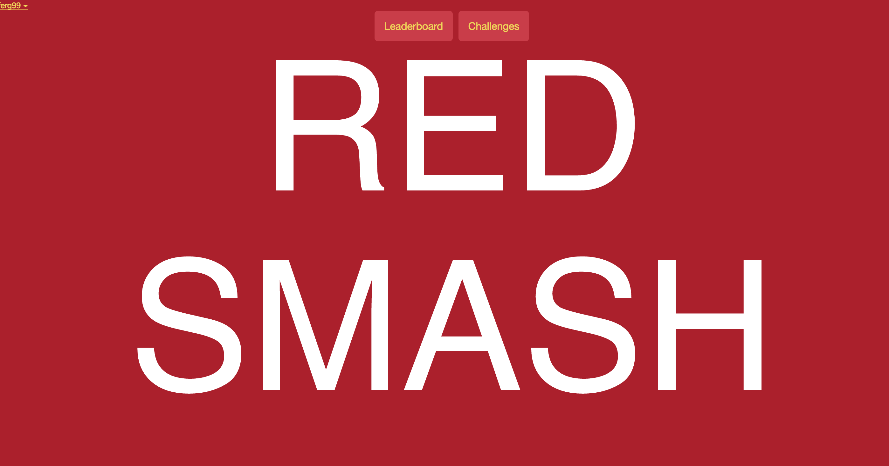

#RED SMASH

Scott Clayton & Fergus MacConnell

We created a real-time JavaScript web application called RED SMASH. Users can login/create an account join their program of App Dev, 
Web Dev, UI, UX or Digital Marketing. Navigation between the LeaderBoard, ChallengeList and ChallengeDetails components before selecting 
a challenge and submitting a reflection in order to gain stars.

RED SMASH was built using Meteor as an application platform, with React as a rendering library and MongoDB as a database.

